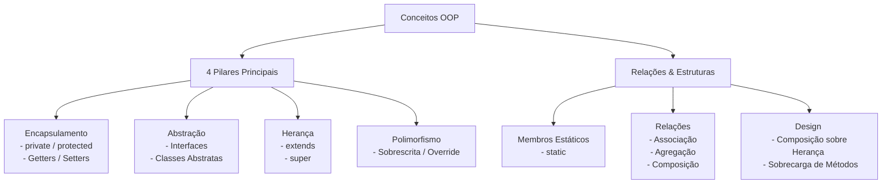

# Conceitos Fundamentais de Orientação a Objetos (OOP) em TypeScript

Este guia contém os pilares de OOP e conceitos avançados explicados de forma simples e direta com trechos mínimos de código.

---

## 1. Encapsulamento (Encapsulation)

Controla o acesso aos dados internos de um objeto, protegendo-os contra alterações indevidas.

* **Modificadores:** `public` (qualquer um acessa), `private` (só a própria classe acessa), `protected` (classe e filhas acessam).
* **Getters & Setters:** Métodos que interceptam a leitura e a escrita de atributos privados para validar dados ou computar valores.

```typescript
class Conta {
  private _saldo: number = 0;

  // Getter: expõe o valor para leitura segura
  get saldo(): number {
    return this._saldo;
  }

  // Setter: valida o valor antes de alterar o atributo privado
  set saldo(valor: number) {
    if (valor >= 0) {
      this._saldo = valor;
    }
  }
}

const conta = new Conta();
conta.saldo = 100;    // Chama o SETter (saldo vira 100)
conta.saldo = -50;    // Ignorado pelo SETter (continua 100)
console.log(conta.saldo); // Chama o GETter -> 100
```

---

## 2. Abstração (Abstraction)

Esconde a complexidade de como algo funciona por trás de uma interface simples de usar.

* **Interface:** Define apenas as assinaturas (o contrato do que deve ser feito).
* **Classe Abstrata:** Um rascunho que não pode ser instanciado diretamente. Pode ter métodos sem código (`abstract`) e métodos prontos com comportamento padrão.

```typescript
// Interface: Apenas o contrato
interface Ligavel {
  ligar(): void;
}

// Classe Abstrata: Permite misturar contratos com comportamentos prontos
abstract class Veiculo {
  constructor(public marca: string) {}

  buzinar() { console.log("Beep!"); } // Método pronto
  abstract mover(): void;              // Método abstrato (sem código)
}

class Carro extends Veiculo implements Ligavel {
  ligar() { console.log("Motor ligado"); }
  mover() { console.log("Carro andando"); }
}
```

---

## 3. Herança (Inheritance)

Permite que uma classe filha herde atributos e métodos de uma classe pai, promovendo reutilização de código.

* **`extends`:** Declara que uma classe herda de outra.
* **`super`:** Chama o construtor ou métodos da classe pai.

```typescript
class Animal {
  constructor(public nome: string) {}
  comer() { console.log(`${this.nome} está comendo.`); }
}

class Cachorro extends Animal {
  constructor(nome: string, public raca: string) {
    super(nome); // Passa o nome para o construtor de Animal
  }

  latir() { console.log("Au Au!"); }
}

const cao = new Cachorro("Rex", "Poodle");
cao.comer(); // Herdado de Animal -> "Rex está comendo."
cao.latir(); // Exclusivo de Cachorro -> "Au Au!"
```

---

## 4. Polimorfismo (Polymorphism)

A capacidade de diferentes objetos responderem à mesma chamada de método de maneiras diferentes.

```typescript
class Animal {
  fazerSom() { console.log("Som genérico..."); }
}

class Cachorro extends Animal {
  fazerSom() { console.log("Au Au!"); } // Sobrescrita (Override)
}

class Gato extends Animal {
  fazerSom() { console.log("Miau!"); } // Sobrescrita (Override)
}

// O Polimorfismo em ação:
const animais: Animal[] = [new Cachorro(), new Gato()];

animais.forEach(animal => {
  animal.fazerSom(); // Cada um faz seu som específico
});
```

---

## 5. Membros Estáticos (Static Members)

Atributos e métodos que pertencem à própria classe, e não às instâncias (objetos criados com `new`). Útil para funções utilitárias ou configurações compartilhadas.

```typescript
class Matematica {
  static PI = 3.14159;

  static somar(a: number, b: number): number {
    return a + b;
  }
}

// Não usamos "new Matematica()". Acessamos direto da classe:
console.log(Matematica.PI); // 3.14159
console.log(Matematica.somar(5, 10)); // 15
```

---

## 6. Relações entre Objetos (Associação, Agregação e Composição)

Nem toda relação precisa ser Herança ("é um"). Objetos podem se relacionar de outras formas ("tem um" ou "usa um").

```typescript
// 1. Associação (Uso independente: um usa o outro)
class Caneta {
  escrever() { console.log("Escrevendo..."); }
}
class Escritor {
  escreverTexto(caneta: Caneta) { caneta.escrever(); } // Apenas usa a caneta
}

// 2. Agregação (Todo/Parte fraco: as partes existem sem o todo)
class Produto {
  constructor(public nome: string) {}
}
class Carrinho {
  private produtos: Produto[] = [];
  adicionar(p: Produto) { this.produtos.push(p); } // Se o carrinho for deletado, os produtos ainda existem
}

// 3. Composição (Todo/Parte forte: as partes morrem junto com o todo)
class Processador {
  constructor(public modelo: string) {}
}
class Computador {
  private processador: Processador;

  constructor() {
    this.processador = new Processador("Intel i9"); // Criado dentro, morre se o Computador for destruído
  }
}
```

---

## 7. Composição vs Herança (Composition over Inheritance)

Princípio de design de software que sugere que é melhor criar sistemas flexíveis **compondo objetos** ("tem um") do que criando **heranças profundas** ("é um").

```typescript
// Ruim (Herança): Carro herda de Motor? Carro NÃO é um motor.
// Bom (Composição): Carro TEM UM motor.
class Motor {
  ligar() { console.log("Vrumm!"); }
}

class Carro {
  private motor: Motor;

  constructor() {
    this.motor = new Motor(); // Composição
  }

  ligarCarro() {
    this.motor.ligar(); // Delega a ação para o motor
  }
}
```

---

## 8. Sobrecarga de Métodos (Method Overloading)

Definição de múltiplas assinaturas para um único método, mudando a quantidade ou o tipo dos argumentos. Em TypeScript, declaramos as assinaturas e depois fornecemos uma única implementação que lida com todos os casos.

```typescript
class Impressora {
  // Assinaturas de sobrecarga
  imprimir(texto: string): void;
  imprimir(numero: number): void;

  // Implementação única que gerencia ambos
  imprimir(conteudo: any): void {
    if (typeof conteudo === "string") {
      console.log(`Texto: ${conteudo}`);
    } else {
      console.log(`Número: ${conteudo.toFixed(2)}`);
    }
  }
}

const print = new Impressora();
print.imprimir("Olá"); // Imprime "Texto: Olá"
print.imprimir(42);    // Imprime "Número: 42.00"
```

---

## Resumo Visual dos Conceitos


