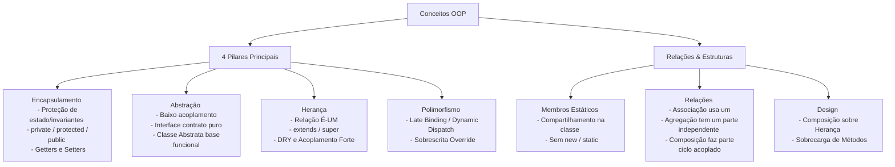

# Conceitos Fundamentais de Orientação a Objetos (OOP) em TypeScript

Este documento aprofunda os conceitos teóricos e práticos de Programação Orientada a Objetos (OOP), explicando a motivação arquitetural por trás de cada recurso, enquanto mantém os exemplos de código curtos e focados.

---

## 1. Encapsulamento (Encapsulation)

### O Problema que Resolve
Sem encapsulamento, qualquer parte do sistema pode ler e modificar diretamente o estado (atributos) de um objeto. Isso gera um **acoplamento forte** e facilita a corrupção do estado interno por valores inválidos ou inconsistentes com as regras de negócio (quebra de invariantes).

### Conceito
O encapsulamento agrupa dados (propriedades) e comportamentos (métodos) em uma única unidade (a classe) e restringe o acesso direto ao estado interno. O objeto passa a se comportar como uma "caixa preta" que expõe apenas uma interface controlada de interação.

* **Modificadores de Acesso (Visibility Control):**
  * `public`: Acessível de qualquer ponto do sistema.
  * `private`: Restrito apenas ao escopo interno da própria classe. Impede vazamento de escopo.
  * `protected`: Restrito à classe atual e às suas subclasses (filhas). Útil para estender comportamentos sem expor a API ao público geral.
* **Getters & Setters:** Funcionam como interceptores e portas de segurança. Em vez de expor uma variável diretamente, expõe-se um método que finge ser uma propriedade. Isso permite adicionar validações, transformações de dados em tempo real ou computar propriedades dinamicamente (ex: retornar nome completo com base em nome e sobrenome).

```typescript
class Conta {
  private _saldo: number = 0; // Estado encapsulado e protegido

  // Getter: expõe o valor para leitura segura
  get saldo(): number {
    return this._saldo;
  }

  // Setter: valida o valor antes de alterar o atributo privado
  set saldo(valor: number) {
    if (valor >= 0) {
      this._saldo = valor;
    }
  }
}

const conta = new Conta();
conta.saldo = 100;    // Chama o SETter (saldo vira 100)
conta.saldo = -50;    // Ignorado pelo SETter (continua 100)
console.log(conta.saldo); // Chama o GETter -> 100
```

---

## 2. Abstração (Abstraction)

### O Problema que Resolve
Sistemas reais são extremamente complexos. Se um desenvolvedor precisasse entender cada detalhe de implementação de cada classe para utilizá-la, o desenvolvimento seria inviável. Além disso, se a implementação interna mudar, todas as partes que dependem dela quebrariam.

### Conceito
Abstrair é isolar as características essenciais de um objeto, focando no **o que ele faz** e não no **como ele faz**. Criamos uma barreira (a interface ou classe abstrata) que protege os clientes das mudanças de implementação interna de um módulo.

* **Interface vs Classe Abstrata:**
  * **Interface (`interface`):** É um contrato 100% puro. Não possui estado (variáveis) nem implementação (métodos com corpo). Ela apenas dita as assinaturas dos métodos que uma classe *deve* possuir. É ideal para definir comportamentos comuns a classes sem parentesco (ex: `Autenticavel`, `Imprimivel`).
  * **Classe Abstrata (`abstract class`):** É um modelo parcial. Ela não pode ser instanciada diretamente (`new`), mas pode conter estado (atributos), métodos totalmente implementados (compartilhamento de código comum) e métodos abstratos (contratos que as classes filhas são obrigadas a programar). É ideal para definir uma base comum para classes altamente relacionadas.

```typescript
// Interface: Contrato abstrato de comportamento
interface Ligavel {
  ligar(): void;
}

// Classe Abstrata: Modelo parcial com compartilhamento de lógica
abstract class Veiculo {
  constructor(public marca: string) {}

  buzinar() { console.log("Beep!"); } // Comportamento herdado por padrão
  abstract mover(): void;              // Cada filho decide como mover
}

class Carro extends Veiculo implements Ligavel {
  ligar() { console.log("Motor ligado"); }
  mover() { console.log("Carro andando"); }
}
```

---

## 3. Herança (Inheritance)

### O Problema que Resolve
Evita a duplicidade de código (princípio DRY - Don't Repeat Yourself) ao agrupar atributos e comportamentos comuns em uma superclasse, permitindo que subclasses se especializem sem reescrever a base do zero.

### Conceito
É a relação de **"é um"** (ex: um `Cachorro` *é um* `Animal`). A subclasse herda as características da superclasse e pode adicionar novos atributos/métodos ou alterar comportamentos existentes.

* **O acoplamento gerado pela Herança:** Embora poderosa, a herança cria o nível mais forte de acoplamento possível entre duas classes. Alterações na superclasse podem propagar efeitos colaterais catastróficos nas subclasses (problema conhecido como *Superclass Fragility*).
* **`super`:** Usado no construtor da subclasse para inicializar a superclasse primeiro, e nos métodos para chamar implementações originais do pai.

```typescript
class Animal {
  constructor(public nome: string) {}
  comer() { console.log(`${this.nome} está comendo.`); }
}

class Cachorro extends Animal {
  constructor(nome: string, public raca: string) {
    super(nome); // Inicializa o construtor do pai
  }

  latir() { console.log("Au Au!"); }
}

const cao = new Cachorro("Rex", "Poodle");
cao.comer(); // Herdado de Animal -> "Rex está comendo."
cao.latir(); // Exclusivo de Cachorro -> "Au Au!"
```

---

## 4. Polimorfismo (Polymorphism)

### O Problema que Resolve
Se tivéssemos que escrever código diferente para cada tipo específico de objeto que processamos, nosso código seria cheio de condicionais (`if/else` ou `switch` checando tipos) e seria extremamente rígido a mudanças (violação do Open-Closed Principle).

### Conceito
Significa "muitas formas". É a capacidade de tratar diferentes subclasses através de uma interface ou classe pai genérica, invocando os mesmos métodos de forma transparente. Em tempo de execução, o sistema descobre o tipo real do objeto e executa a implementação correspondente (*Dynamic Dispatch / Late Binding*).

* **Sobrescrita (Method Overriding):** É o mecanismo polimórfico por excelência. A classe filha fornece uma nova implementação para um método que já existe na classe pai, alterando seu comportamento.

```typescript
class Animal {
  fazerSom() { console.log("Som genérico..."); }
}

class Cachorro extends Animal {
  fazerSom() { console.log("Au Au!"); } // Sobrescrita
}

class Gato extends Animal {
  fazerSom() { console.log("Miau!"); } // Sobrescrita
}

// Polimorfismo: Tratamos objetos específicos de forma genérica
const animais: Animal[] = [new Cachorro(), new Gato()];

animais.forEach(animal => {
  animal.fazerSom(); // Resolve dinamicamente: chama Au Au! e Miau!
});
```

---

## 5. Membros Estáticos (Static Members)

### Conceito
Atributos e métodos definidos com a palavra-chave `static` pertencem à **classe em si (ao seu escopo na memória)** e não às instâncias individuais criadas por ela. 

* **Casos de Uso:** Criação de métodos utilitários matemáticos, formatações globais ou aplicação de padrões de projeto como *Factory* ou *Singleton*.
* **Vantagem de Performance:** Como pertencem à classe, esses métodos não são duplicados na memória heap a cada instância criada.
* **Perigo:** Variáveis estáticas públicas funcionam essencialmente como "variáveis globais", o que quebra o encapsulamento, dificulta a criação de testes unitários isolados e gera acoplamento oculto.

```typescript
class Matematica {
  static PI = 3.14159;

  static somar(a: number, b: number): number {
    return a + b;
  }
}

// Acesso direto pela classe, sem instanciar com "new"
console.log(Matematica.PI); // 3.14159
console.log(Matematica.somar(5, 10)); // 15
```

---

## 6. Relações entre Objetos (Associação, Agregação e Composição)

Diferente da Herança ("é um"), essas relações descrevem como as classes interagem e dependem umas das outras através da posse ou uso ("tem um" ou "usa um"). A grande diferença está no **ciclo de vida** dos objetos envolvidos.

### 1. Associação (Relação Fraca - "Usa um")
Os objetos possuem ciclos de vida independentes. Um objeto apenas se comunica ou utiliza serviços do outro temporariamente.
* *Exemplo:* Um `Escritor` usa uma `Caneta`. A caneta existe sem o escritor, e o escritor pode escrever usando um lápis se a caneta sumir.

### 2. Agregação (Relação Todo-Parte Fraca - "Tem um")
Uma classe contém referências a objetos de outra classe como suas "partes". No entanto, os objetos agregados (as partes) podem existir independentemente do objeto container (o todo).
* *Exemplo:* Um `Carrinho` possui `Produtos`. Se o carrinho for deletado no banco de dados, os produtos ainda existem fisicamente no estoque.

### 3. Composição (Relação Todo-Parte Forte - "Faz parte de")
Uma classe é dona absoluta e responsável direta pela criação e destruição das suas partes. Os objetos contidos não possuem vida própria fora do objeto pai. Se o pai for deletado, os filhos são destruídos automaticamente.
* *Exemplo:* Um `Computador` e seu `Processador`. O processador é soldado ou inicializado dentro do computador. Se descartamos o computador, o processador contido nele vai junto.

```typescript
// 1. Associação (Uso independente)
class Caneta {
  escrever() { console.log("Escrevendo..."); }
}
class Escritor {
  escreverTexto(caneta: Caneta) { caneta.escrever(); }
}

// 2. Agregação (Todo/Parte independente)
class Produto {
  constructor(public nome: string) {}
}
class Carrinho {
  private produtos: Produto[] = [];
  adicionar(p: Produto) { this.produtos.push(p); }
}

// 3. Composição (Todo/Parte acoplado)
class Processador {
  constructor(public modelo: string) {}
}
class Computador {
  private processador: Processador;

  constructor() {
    // Criação interna: Ciclo de vida atrelado
    this.processador = new Processador("Intel i9");
  }
}
```

---

## 7. Composição vs Herança (Composition over Inheritance)

### Motivação Arquitetural
A Herança engessa o design do software. Uma vez herdada, a subclasse recebe tudo o que a superclasse possui, inclusive métodos inúteis ou indesejados (problema conhecido como *"banana, gorilla and jungle problem"*: você quer apenas a banana, mas herda o gorila segurando a banana e a selva inteira). Além disso, a herança é definida em tempo de compilação.

A Composição dá mais flexibilidade porque as relações podem ser injetadas e modificadas dinamicamente em tempo de execução (*polimorfismo de composição*), facilitando a substituição e a testabilidade de partes do sistema.

```typescript
// Ruim: Carro herdar de Motor (Carro NÃO é um motor).
// Bom: Carro contendo um Motor (Carro TEM UM motor).
class Motor {
  ligar() { console.log("Vrumm!"); }
}

class Carro {
  private motor: Motor;

  constructor() {
    this.motor = new Motor(); // O comportamento de ligar é delegado ao motor
  }

  ligarCarro() {
    this.motor.ligar(); // Delegação
  }
}
```

---

## 8. Sobrecarga de Métodos (Method Overloading)

### Conceito
Capacidade de definir um mesmo método com o mesmo nome na mesma classe, porém com assinaturas (parâmetros e retornos) diferentes.

* **Particularidade do TypeScript:** Em linguagens como C# ou Java, você escreve o método com o mesmo nome várias vezes, cada um com seus tipos de parâmetro. No TypeScript/JavaScript, a sobrecarga física em tempo de execução não é suportada diretamente pelo motor da linguagem.
* **Como funciona no TS:** Declaramos as diferentes assinaturas que queremos expor ao compilador, e depois escrevemos uma **única implementação** geral que inspeciona dinamicamente os tipos recebidos em runtime para saber como se comportar.

```typescript
class Impressora {
  // Assinaturas visíveis para o compilador
  imprimir(texto: string): void;
  imprimir(numero: number): void;

  // Implementação única que trata as opções
  imprimir(conteudo: any): void {
    if (typeof conteudo === "string") {
      console.log(`Texto: ${conteudo}`);
    } else if (typeof conteudo === "number") {
      console.log(`Número: ${conteudo.toFixed(2)}`);
    }
  }
}

const print = new Impressora();
print.imprimir("Olá"); // Saída compilada aceita string
print.imprimir(42);    // Saída compilada aceita number
```

---

## Resumo Visual dos Conceitos


